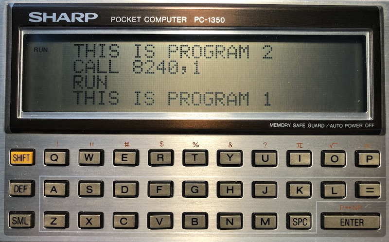

# MultiPC: a multi-program manager for SHARP pocket computers

This small but powerful machine code program manages up to ten BASIC programs
residing simultaneously in memory on your SHARP pocket computer.  Each of the
ten BASIC programs can be independently run, edited, `CLOAD`ed from tape,
`CSAVE`d, `MERGE`d and `CHAIN`ed.

Benefits:

- stores up to 10 BASIC programs simultaneously in memory
- variables and arrays retain their value after switching programs
- the machine code and programs reside on a RAM card, when present
- removing and inserting a RAM card retains the machine code and programs

Do not:

- switch programs from within a running program
- use `TEXT`, unless you go back to `BASIC` before switching programs

The following instructions use a cassette interface (CE-126P or CE-124).  If
you do not have a cassette interface, then type over the BASIC installer code
and `RUN` (instead of DEF-A) to verify it and install.

## SHARP PC-1350 with 16KB RAM card

Installation:

Play the multi16.wav file and `CLOAD` then press DEF-A to install.  This shows:
`*123456789` with 10 program slots available and the current slot is `0`.

Usage:

`CALL 8240` shows the 10 program slots with digits 0 to 9 indicating available
slots and `_` for used slots.  The current program slot switched to is `*`.

`CALL 8240,0` switch to program 0, `CALL 8240,1` switch to program 1, and so on
up to program 9.

To clear a program slot just make it the current slot and enter `NEW`.

`CALL 8240,NEW` clears all 10 programs.

To make this easier and avoid costly mistakes when entering the calling
address, in RESERVE MODE define the S (switch) key:

`S: CALL 8240,`

## SHARP PC-1350 with 8KB RAM card

Installation:

Play the multi8.wav file and `CLOAD` then press DEF-A to install.  This shows:
`*123456789` with 10 program slots available and the current slot is `0`.

Usage:

`CALL 16432` shows the 10 program slots with digits 0 to 9 indicating available
slots and `_` for used slots.  The current program slot switched to is `*`.

`CALL 16432,0` switch to program 0, `CALL 16432,1` switch to program 1, and so
on up to program 9.

To clear a program slot just make it the current slot and enter `NEW`.

`CALL 16432,NEW` clears all 10 programs.

To make this easier and avoid costly mistakes when entering the calling
address, in RESERVE MODE define the S (switch) key:

`S: CALL 16432,`

## SHARP PC-1350 without a RAM card

Installation:

Play the multi0.wav file and `CLOAD` then press DEF-A to install.  This shows:
`*123456789` with 10 program slots available and the current slot is `0`.

Usage:

`CALL 24624` shows the 10 program slots with digits 0 to 9 indicating available
slots and `_` for used slots.  The current program slot switched to is `*`.

`CALL 24624,0` switch to program 0, `CALL 24624,1` switch to program 1, and so
on up to program 9.

To clear a program slot just make it the current slot and enter `NEW`.

`CALL 24624,NEW` clears all 10 programs.

To make this easier and avoid costly mistakes when entering the calling
address, in RESERVE MODE define the S (switch) key:

`S: CALL 24624,`

## Converting BAS to WAV files

I used the excellent [PocketTools](https://www.peil-partner.de/ifhe.de/sharp/)
to convert BASIC source code to wav files:

    bas2img --pc=1350 --level=8 switch16.bas
    bin2wav --pc=1350 switch16.img

## For developers

The target machine and RAM card choice is defined in `target.h`, for example
the PC-1350 with 16KB card:

    __RAM_SLOT1__ =  16
    .include "pc1350.h"

To assemble the code, you need the AS61860 assembler and linker, see:
- <https://www.qsl.net/yt2fsg/pocket/pocket_asm.html>
- <http://shop-pdp.net/ashtml/asxxxx.php>

The ihx2bas tool included with this project converts IHX format to a BASIC
bootloader program.

The `pc1350.h` file is sourced and extended from the PShell project:
- <https://edgar-pue.tripod.com/sharp/pshell.html>
